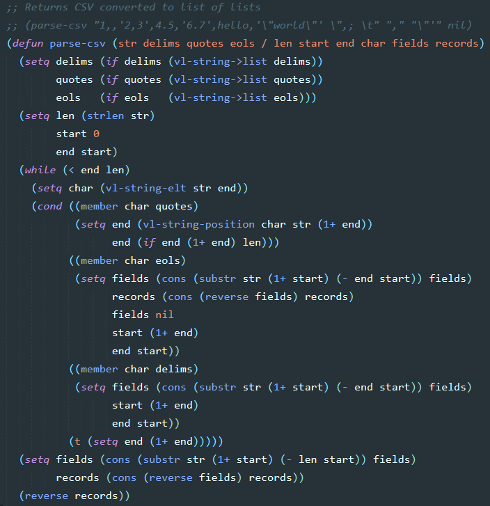

# AutoLISP for Sublime Text

AutoCAD AutoLISP programming language package for Sublime Text.

Supports syntax highlighting for vanilla [AutoLISP and Visual LISP](http://help.autodesk.com/view/ACD/2017/ENU/?guid=GUID-49AAEA0E-C422-48C4-87F0-52FCA491BF2C), [BricsCAD LISP](https://www.bricsys.com/bricscad/help/en_US/CurVer/DevRef/source/Introduction.htm) and [CALL](https://github.com/divtiply/call) flavors.

## Installation
Install using [Package Control](https://packagecontrol.io/).

## Activation
Open any AutoLISP file with Sublime Text, invoke menu item `View -> Syntax -> Open all with current extension as...` and select `AutoLISP`.

## Screenshots

## Optional dependencies
Build system is dependent on [AutoLISP console](https://github.com/divtiply/autolisp-console).
