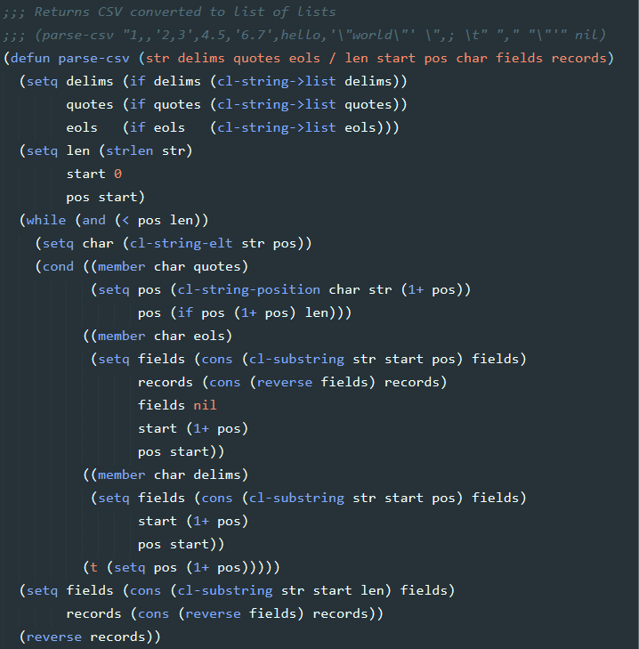

# AutoLISP for Sublime Text

AutoCAD AutoLISP programming language package for Sublime Text.

Supports syntax highlighting for vanilla AutoLISP, VisualLISP, BricsCAD LispEx and CALL flavors.

## Screenshots

